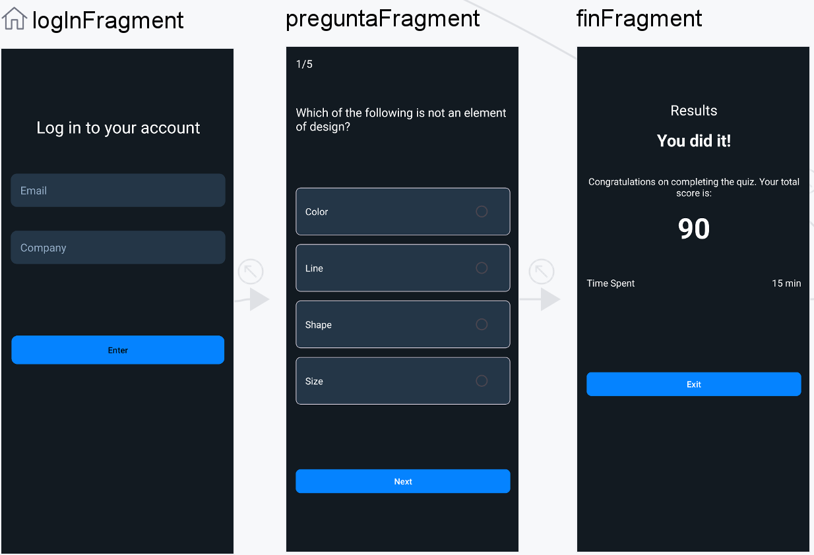
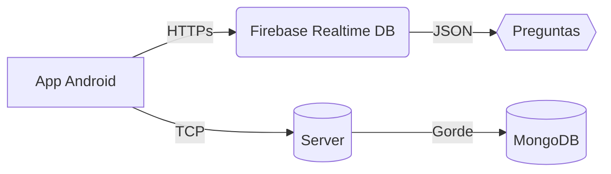

## Aplikazio mugikorra

## Lands & Legends

<p align="center">
  
</p>

## Deskribapen laburra

**Lands & Legends** aplikazio mugikor interaktibo bat da, galdera-sorta dinamiko baten bidez ikasteko eta entretenitzeko esperientzia bat eskaintzeko diseinatua. Aplikazioak funtzionalitate hauek ditu: erabiltzaileen autentifikazioa, galderen kudeaketa, puntuazio-sistema eta hizkuntza anitzeko euskarria.

## Ezaugarri nagusiak

- **Erabiltzaileen autentifikazioa:** Erabiltzaileek saioa has dezakete beren helbide elektronikoa eta enpresaren izena erabiliz.
- **Galdetegi interaktiboa:** Erabiltzaileek ausaz hautatutako galderei erantzuten diete Firebadetik.
- **Puntuazio- eta denbora-sistema:** Aplikazioak puntuazioa eta partidan igarotako denbora kalkulatzen ditu.
- **Hizkuntza anitza:** Aplikazioak gailuaren hizkuntza detektatzen du eta edukia dagokion hizkuntzan erakusten du.
- **Offline datuen kudeaketa:** App-ak konexiorik gabe funtzionatzen du eta datuak sinkronizatzen ditu Internet dagoenean.
- **Jakinarazpenak eta oroigarriak:** Erabiltzaileak jolastera motibatzeko eguneroko oroigarriak.

## Diseinu

<p align="center">
  
</p>

## Erabilitako teknologiak

| **Kategoria**                 | **teknologiak**                   | **Erabilera proiektuan**                                     |
| ----------------------------------- | --------------------------------------- | ------------------------------------------------------------------ |
| **Arkitektura**               | MVVM (Model-View-ViewModel)             | IUren, logikaren eta datuen arteko bereizketa garbia               |
|                                     | LiveData + ViewModel                    | Osagaien arteko komunikazio erreaktiboa                            |
| **Tokiko iraunkortasuna**     | Room Database                           | Emaitzak eta datuak biltegiratzea                                  |
| **Backend denbora errealean** | Firebase Realtime Database              | Galderen eta erantzunen iturri nagusia                             |
| **Jakinarazpenak**            | AlarmManager + WorkManager              | Oroigarri programagarriak eta zereginen kudeaketa bigarren planoan |
| **Sareak**                    | OkHttp (v4.9.3) + Retrofit              | TCP zerbitzariarekiko komunikazioa (emaitzak bidaltzea)            |
| **Irisgarritasuna**           | TextToSpeech API                        | Galderak ozenki irakurtzea                                         |
| **UI/UX**                     | Jetpack Navigation Component            | Fragmenten arteko nabigazioa                                       |
|                                     | ViewBinding                             | IUko elementuetarako sarbide segurua                               |
| **Hizkuntza anitza**          | Android Resources (values-es/values-eu) | Espainiera, euskara eta ingeleserako euskarria                     |

## Proiektuaren egitura

```
jakin_mina/
    ├── model/
    │   ├── AppDatabase.java
    │   ├── DatosPendientesDao.java
    │   ├── DatosPendientes.java
    │   ├── UserRepository.java
    │   └── Pregunta.java
    ├── view/
    │   ├── FinFragment.java
    │   ├── LogInFragment.java
    │   ├── MainActivity.java
    │   └── PreguntaFragment.java
    ├── viemodel/
    │   ├── LogInViewModel.java
    │   ├── FinViewModel.java
    │   └── PreguntaViewModel.java
    ├── NotificationWorker.java
    ├── NetworkUtils.java
    ├── DailyReminderReceiver.java
    └── EnvioWorker.java
```

## 📲 Aplikazioaren erabilera

1. **Ireki app-a eta hasi**

   - Idatzi zure posta elektronikoa.
   - **"Hasi"** botoia sakatu.
2. **Egunean 5 galdera erantzuten ditu**

   - Irakurri galdera pantailan edo tokatu app-ak ozen irakur dezan.
   - Aukeratu **erantzun zuzen bat** 4 aukeren artean.
   - Ukitu **"Hurrengoa"** erantzun bakoitzaren ondoren.
3. **Lortu puntuak**

   - Egunean **50 punturekin** hasten zara.
   - Huts eginez gero, **10 puntu** galduko dituzu (inoiz ez 0 baino gutxiago).
   - Amaitzean, ikusi zure azken puntuazioa!

---

💡 **Kontseilua:**
Aktibatu eguneroko oroigarriak app-ean, egun bakar batean ere ez galtzeko eta puntu gehiago irabazteko.

## Instalatzea eta exekuzio

# 🛠 Lands and Legends instalatzeko gida

## 📋 Aurrebaldintzak

- Android Studio (Arctic Fox bertsioa edo goragokoa)
- JDK 11 instalatuta
- Android gailua edo emuladorea (API 26+)
- Datu-baseetarako Firebase kontua
- TCP zerbitzaria funtzionatzen
- Api martxan

---

## 🔥 Firebase konfiguratzea

### 1. Firebason proiektua sortzea

1. Zoaz [Firebase Console](https://console.firebase.google.com)
2. Sor ezazu proiektu berri bat, LandsandLegends, izenekoa.
3. **Build > Realtime Database** atalean, sortu datu-base berri bat froga moduan

### 2. Datu-basearen egitura

```json
{
  "preguntas": [
    {
      "id": 1,
      "correcta": "A",
      "es": "¿Cuál es la capital de Francia?",
      "en": "Which is the capital of France?",
      "eu": "Zein da Frantziako hiriburua?",
      "opciones": {
        "es": ["A) París", "B) Berlín", "C) Roma", "D) Madrid"],
        "en": ["A) Paris", "B) Berlin", "C) Rome", "D) Madrid"],
        "eu": ["A) Paris", "B) Berlin", "C) Erroma", "D) Madrid"]
      }
    }
    // ... egitura bereko galdera gehiago
  ]
}
```

### 3. Android App estekatu

1. Firebase Console-n, zoaz hona:**Project settings > Your apps**
2. Erantsi Android aplikazio berria:
   - **Package name**: com.t4.jakin_mina
   - Deskargatu Google-￮ services.json, eta jarri "App" moduan.

---

## 📥 App-a instalatzea

### 1. Klonatu repoa

```bash
git clone https://github.com/PAAG-2-Ethazi-2024-25/erronka-2-4taldea-josud-gersonc-maidera-anerg.git
```

### 2. IP konfiguratu

Ikus ezazu `model/UserRepository.java`:

```
String url = "http://10.0.2.2:1111/employee/login/"+ encodedEmail + "/{companyName}?companyName=" + encodedCompany;
```

`10.0.2.2` ordezkatzen du zure API zerbitzariaren IParekin.

Ikus ezazu `jakin_mina/EnvioWorker.java` :

```
    public static final String SERVER_IP = "10.0.2.2"; // Cambiar por IP real
    public static final int SERVER_PORT = 12321; // Puerto del servidor
```

`10.0.2.2` ordezkatzen du zure TCP zerbitzariaren IParekin.

### 3. Sinkronizatu eta exekutatu

1. Ireki proiektua Android Studion
2. Gradle-rekin sinkronizatzen du
3. Exekutatu gailuan/emulagailuan Run-rekin ▶️

---

## 🔌 Konexioen egitura



---

## 🚨 Funtsezko puntuak

1. **Firebase** arauak (garapen moduan):

```json
{
  "rules": {
    "preguntas": {
      ".read": true,
      ".write": false
    }
  }
}
```

---

## 🧪 Instalazio-proba

1. App-a exekutatzea eta egiaztatzea:
   - Galderak Firebase-en kargatzen dira
   - Emaitzak TCP zerbitzarira bidaltzen dira
   - Ez dago konexioekin lotutako errorerik Logcaten

> Ohar garrantzitsua: TCP eta API-a martxan eduki

---

**Oharra:** Proiektu honek oinarrizko ezagutza hauek behar ditu:

- TCP/IP sareak konfiguratzea
- Firebase datu-baseen administrazioa
- Android garapena MVVM arkitekturarekin
